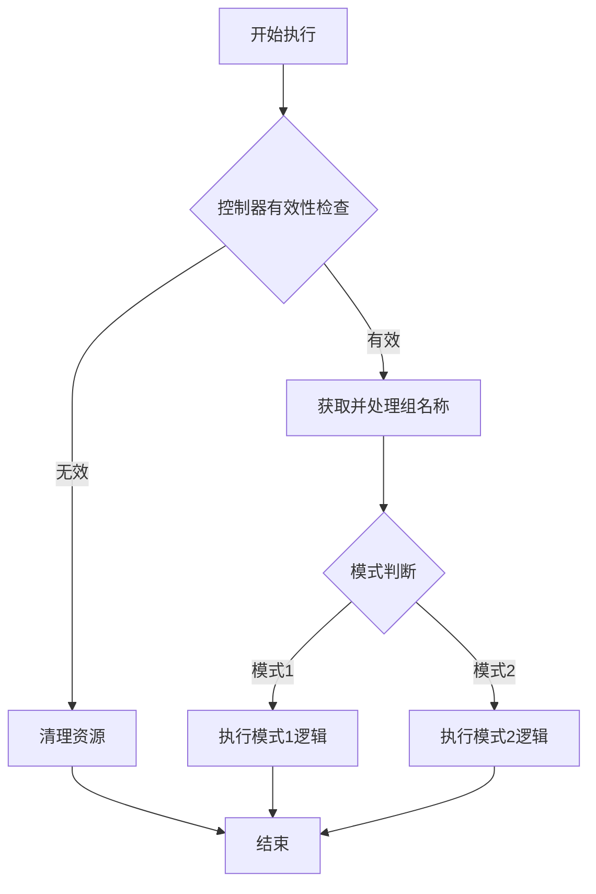
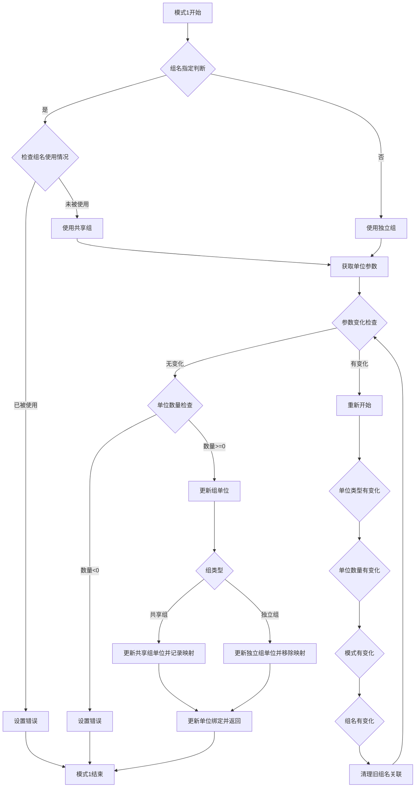
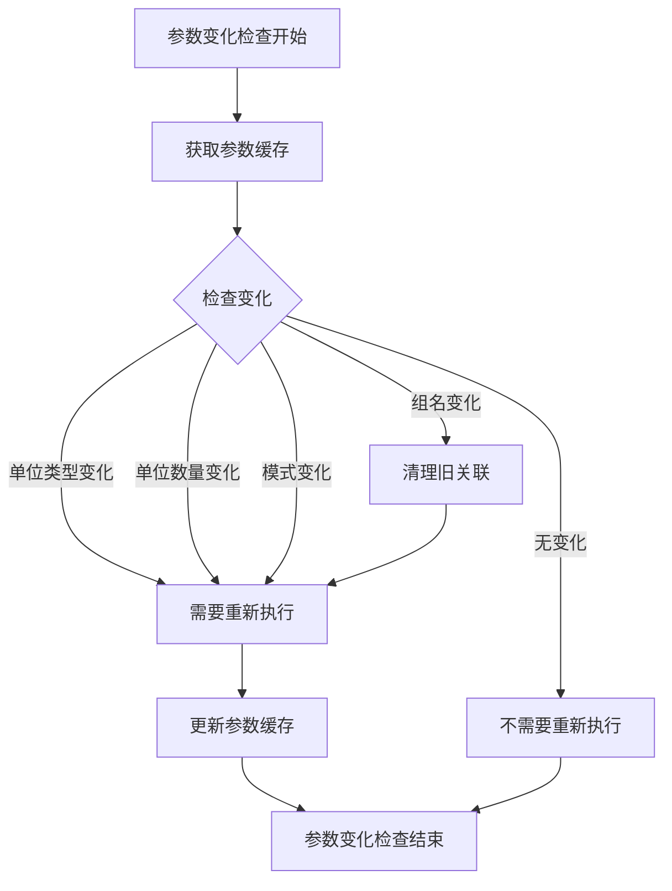
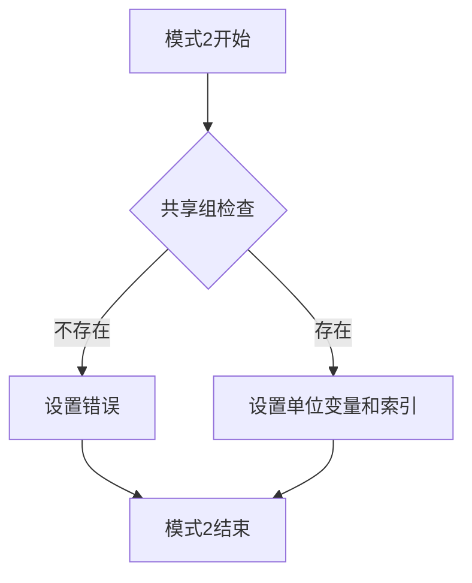

# 单位控制器执行流程（更新版）

## 整体执行流程

## 模式1：抓取模式（核心管理流程）

## 参数变化检查

## 模式2：访问模式（简化衍生流程）

## 设计说明

1. **模式1参数检查逻辑修改**
   - 移除了单位类型检查，只保留数量≥0的检查
   - 参数变化检查移至模式1内部，在获取单位参数后执行
   - 参数变化时清理单位池和缓存，重新开始流程

2. **参数变化检查位置调整**
   - 从checkAndUpdateParams方法移至executeMode1方法内
   - 简化了checkAndUpdateParams方法，只保留必要的逻辑

3. **参数变化检测逻辑**
   - 单位类型变化：当单位类型参数改变时触发重新执行
   - 单位数量变化：当数量参数改变时触发重新执行
   - 模式变化：当模式参数改变时触发重新执行
   - 组名变化：当组名参数改变时，清理旧的组名关联后触发重新执行

4. **流程特点**
   - 共享组支持：允许多个控制器共享同一单位组
   - 独立组支持：为不指定组名的控制器创建独立单位组
   - 错误处理：对各种异常情况设置明确的错误信息
   - 资源管理：包含清理机制，避免资源泄漏

## 代码结构概览

- `run()`: 主执行入口，处理控制器有效性和模式分支
- `executeMode1()`: 实现模式1逻辑，包括组名判断、参数变化检查、单位数量检查和组单位更新
- `executeMode2()`: 实现模式2逻辑，包括共享组检查和单位变量设置
- 辅助方法: 提供单位收集、更新、锁定等功能支持